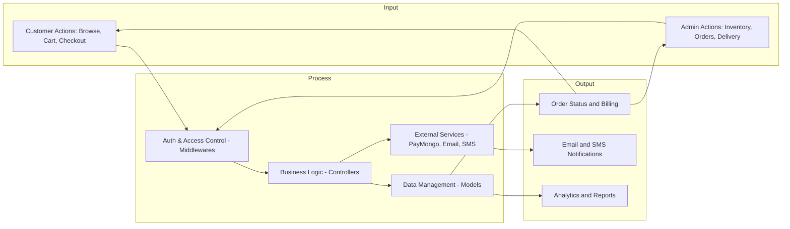
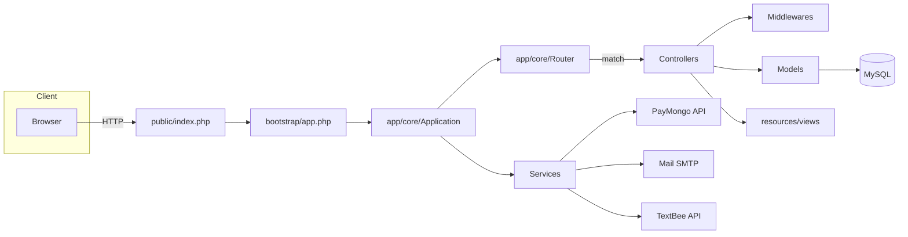
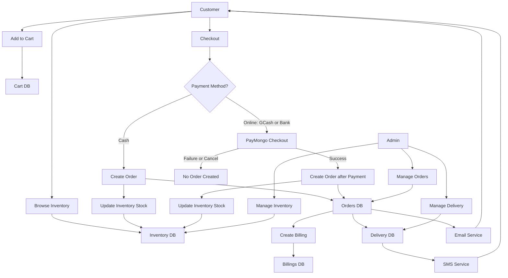
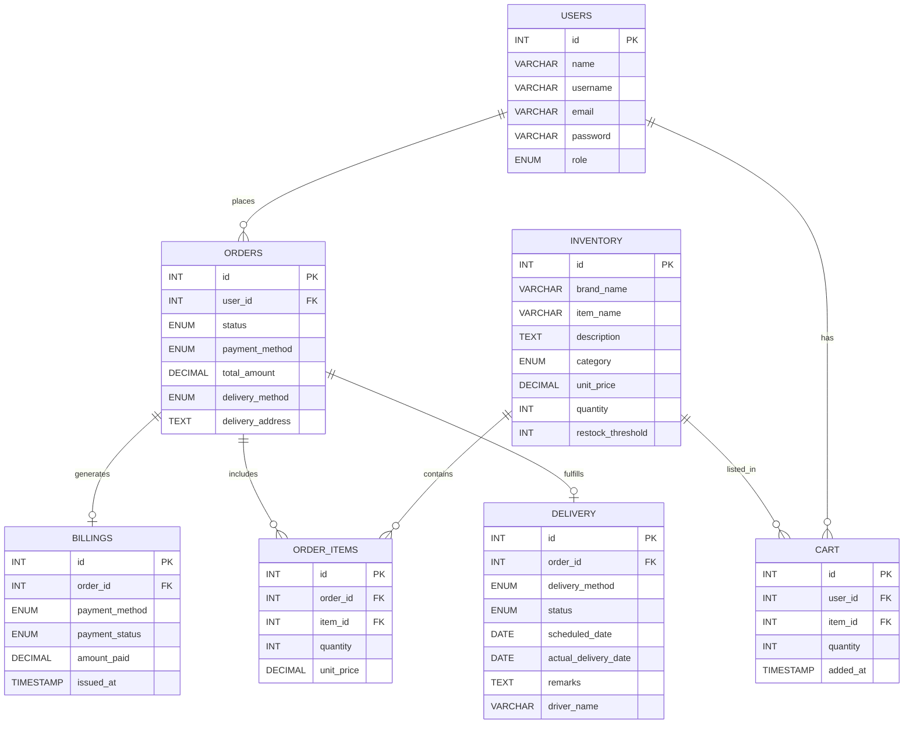

# CHAPTER 3: METHODOLOGY

This chapter describes the research design, conceptual framework, system architecture, data flow, database design, tools and technologies, and system modules for the ABG Prime Builders Supplies Inc. Hardware Inventory and Ordering System. The system is implemented using a custom PHP MVC framework purpose-built for this project.

References to source files are shown using repository-relative paths (e.g., `routes/web.php`).

## 3.1 Research Design
- **Type**: Design-and-Development (D&D) research with iterative prototyping.
- **Approach**: Build–measure–learn cycles to incrementally deliver an e‑commerce platform specialized for hardware retail operations.
- **Rationale**: The e‑commerce domain requires frequent validation of usability, payment reliability, and order–delivery synchronization. Iterative development enables feedback-driven refinement from admins and customer users.

## 3.2 Conceptual Framework
The system follows a layered architecture approach with clear separation of concerns:

- **Presentation Layer**: User interfaces for customers and administrators
- **Application Layer**: Business logic, controllers, and middleware
- **Data Layer**: Database models and data persistence
- **Service Layer**: External integrations (payments, email, SMS)

The framework emphasizes:
- **MVC Pattern**: Model-View-Controller separation for maintainability
- **Middleware Pipeline**: Authentication, authorization, and security checks
- **Service-Oriented Integration**: Modular external service connections
- **Database Abstraction**: ORM-like model layer for data operations

Key implementation artifacts:
- Routing and groups: `routes/web.php`, `app/core/Route.php`, `app/core/Router.php`
- MVC skeleton: `app/core/Application.php`, `app/core/Model.php`, controllers under `app/controllers/`
- Migrations and CLI: `database/migrations/`, `console`, `app/core/Database.php`

## 3.3 System Architecture
The system uses a layered MVC architecture with service integrations.

- **Presentation (Views)**: `resources/views/` rendered via `Router::renderOnlyView()`
- **Application Layer**:
  - Controllers: `app/controllers/admin/`, `app/controllers/customer/`, `app/controllers/AuthController.php`
  - Routing & Middleware: `routes/web.php`, `app/core/Route.php`, middlewares under `app/core/middlewares/`
- **Domain/Data Layer**:
  - ORM-like Models: `app/core/Model.php` with relationships and query helpers
  - Models: `app/models/*.php`
  - Database: MySQL via PDO (`app/core/Database.php`)
- **Services**:
  - Payments: PayMongo (`app/services/PayMongoService.php`)
  - Email: PHPMailer (`app/services/MailService.php`)
  - SMS: TextBee (`app/services/SmsService.php`)

## 3.4 Data Flow Diagram (DFD)

The data flow diagram illustrates how information moves through the system from user interactions to data storage and external services.

## 3.5 Entity Relationship Diagram (ERD)

The database schema is designed for transactional e‑commerce with inventory and fulfillment management.

**Database Tables:**
- **Users**: Customer and admin accounts with email verification
- **Inventory**: Hardware items with multiple images and stock tracking
- **Orders**: Customer orders with status tracking and payment information
- **Order Items**: Individual items within orders with quantities and pricing
- **Billings**: Payment records linked to orders
- **Delivery**: Delivery scheduling and tracking information
- **Cart**: Temporary storage for customer shopping items

## 3.6 Tools and Technologies Used

- **Programming Languages**: PHP (server-side), JavaScript (client-side)
- **Runtime/Server**: Apache/XAMPP or PHP built-in server, MySQL
- **Custom Framework**: In-house MVC (routing, middleware, validation, ORM-like models)
- **Composer Packages** (`composer.json`):
  - `vlucas/phpdotenv` (environment management)
  - `phpmailer/phpmailer` (SMTP email)
  - `guzzlehttp/guzzle` (HTTP client for PayMongo)
- **Node/Build Tooling** (`package.json`):
  - `tailwindcss`, `postcss`, `autoprefixer` (styling)
  - `esbuild` (JS bundling)
  - `flowbite` (UI components)
  - `sweetalert2` (alerts)
- **CLI Utilities**: `console` (serve, migrate, rollback)

## 3.7 System Modules and Functions

### 3.7.1 Authentication Module
- **User Registration**: Account creation with email verification codes
- **Login System**: Role-based authentication (customer/admin)
- **Email Verification**: AbstractAPI integration with fallback validation
- **Security**: Password hashing, session management, CSRF protection

### 3.7.2 Customer Module
- **Inventory Browsing**: Category-based product filtering and search
- **Shopping Cart**: Add, update, remove items with stock validation
- **Checkout Process**: Multi-payment method support (cash, GCash, bank transfer)
- **Order Management**: View order history and status tracking
- **Profile Management**: Update personal information and delivery addresses

### 3.7.3 Admin Module
- **Inventory Management**: CRUD operations for hardware items with multiple image support
- **Order Processing**: View, confirm, and update order statuses
- **Billing System**: Automatic billing generation for confirmed orders
- **Delivery Management**: Schedule and track deliveries with calendar integration
- **Dashboard Analytics**: Sales overview and stock monitoring with Chart.js

### 3.7.4 Payment Integration Module
- **PayMongo Integration**: Secure online payment processing for GCash and bank transfers
- **Checkout Sessions**: Modern payment flow with line item display
- **Payment Verification**: Real-time payment status validation
- **Billing Automation**: Automatic billing record creation for successful payments

### 3.7.5 Communication Module
- **Email Service**: SMTP-based email notifications using PHPMailer
- **SMS Service**: TextBee API integration for delivery notifications
- **Order Confirmations**: Automated email confirmations for successful orders
- **Status Updates**: Customer notifications for order and delivery changes

### 3.7.6 Security and Middleware Module
- **Authentication Middleware**: Protect routes requiring user login
- **Admin Middleware**: Restrict access to administrative functions
- **CSRF Protection**: Prevent cross-site request forgery attacks
- **Input Validation**: Comprehensive form validation with error handling
- **Location Middleware**: Geographic access control for the application
