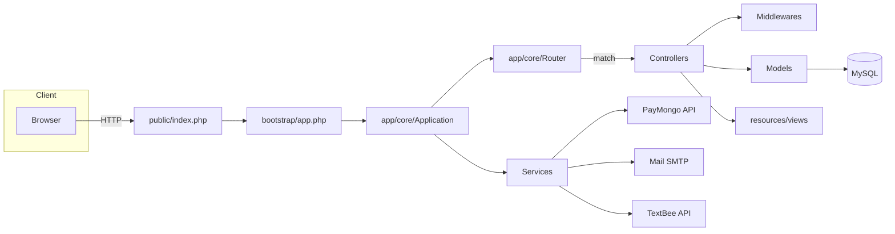
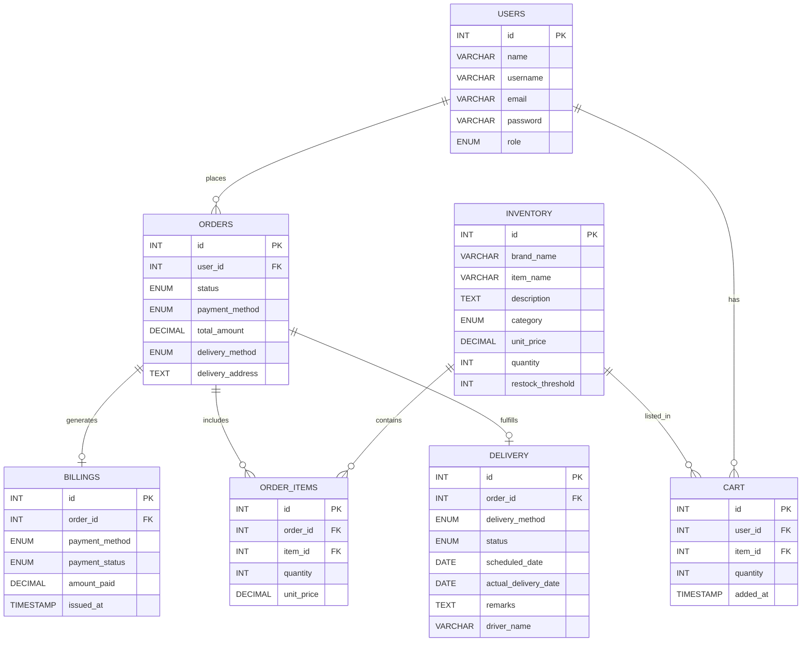
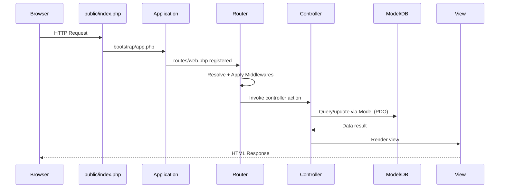
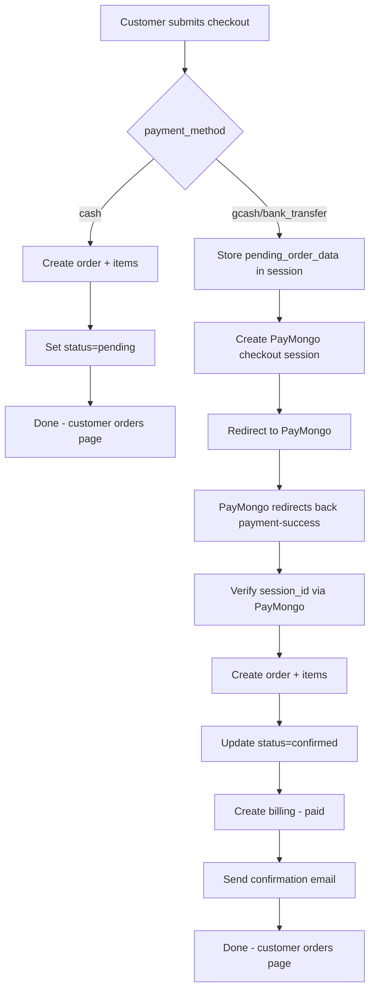
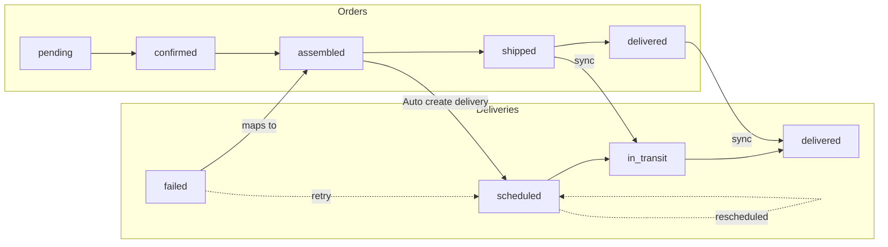

# CHAPTER 3: METHODOLOGY

This chapter describes the research design, development methodology, architecture, tools, database design, core features, system flows, and testing strategy for the ABG Prime Builders Supplies Inc. Hardware Inventory and Ordering System. The system is implemented using a custom PHP MVC framework purpose-built for this project.

References to source files are shown using repository-relative paths (e.g., `routes/web.php`).

## 3.1 Research Design
- **Type**: Design-and-Development (D&D) research with iterative prototyping.
- **Approach**: Build–measure–learn cycles to incrementally deliver an e‑commerce platform specialized for hardware retail operations.
- **Rationale**: The e‑commerce domain requires frequent validation of usability, payment reliability, and order–delivery synchronization. Iterative development enables feedback-driven refinement from admins and customer users.

## 3.2 System Development Methodology
- **Methodology**: Agile-Iterative (Scrum-inspired sprints)
  - **Requirements & Scope**: Elicited from ABG Prime’s ordering, inventory, billing, and delivery workflows.
  - **Architecture & Environment Setup**: Custom MVC framework, environment variables via Dotenv, MySQL database with migrations, and Tailwind-based UI.
  - **Incremental Feature Delivery**: Modules built and integrated by priority: authentication, inventory, cart, checkout, payments, orders, deliveries, and admin dashboard.
  - **Validation**: Continuous testing on each increment; UAT with typical store workflows (browse, cart, checkout, confirm, ship, deliver).
  - **Refinement**: UX, data validation, and process automation iteratively improved based on issues encountered.

Key implementation artifacts:
- Routing and groups: `routes/web.php`, `app/core/Route.php`, `app/core/Router.php`
- MVC skeleton: `app/core/Application.php`, `app/core/Model.php`, controllers under `app/controllers/`
- Migrations and CLI: `database/migrations/`, `console`, `app/core/Database.php`

## 3.3 System Architecture
The system uses a layered MVC architecture with service integrations.

- **Presentation (Views)**: `resources/views/` rendered via `Router::renderOnlyView()`
- **Application Layer**:
  - Controllers: `app/controllers/admin/`, `app/controllers/customer/`, `app/controllers/AuthController.php`
  - Routing & Middleware: `routes/web.php`, `app/core/Route.php`, middlewares under `app/core/middlewares/`
- **Domain/Data Layer**:
  - ORM-like Models: `app/core/Model.php` with relationships and query helpers
  - Models: `app/models/*.php`
  - Database: MySQL via PDO (`app/core/Database.php`)
- **Services**:
  - Payments: PayMongo (`app/services/PayMongoService.php`)
  - Email: PHPMailer (`app/services/MailService.php`)
  - SMS: TextBee (`app/services/SmsService.php`)

### 3.3.1 Architecture Diagram

## 3.4 System Development Tools
- **Programming Languages**: PHP (server), JavaScript (client)
- **Runtime/Server**: Apache/XAMPP or PHP built-in server, MySQL
- **Custom Framework**: In-house MVC (routing, middleware, validation, ORM-like models)
- **Composer Packages** (`composer.json`):
  - `vlucas/phpdotenv` (environment management)
  - `phpmailer/phpmailer` (SMTP email)
  - `guzzlehttp/guzzle` (HTTP client for PayMongo)
- **Node/Build Tooling** (`package.json`):
  - `tailwindcss`, `postcss`, `autoprefixer` (styling)
  - `esbuild` (JS bundling)
  - `flowbite` (UI components)
  - `sweetalert2` (alerts)
- **CLI Utilities**: `console` (serve, migrate, rollback)

## 3.5 Database Design
Relational schema designed for transactional e‑commerce with inventory and fulfillment.

- **Users** (`m_0001_create_users_table.php`):
  - Core fields: `id`, `name`, `username`, `email`, `password`, `role`, profile info
  - Email verification: `email_verified_at`, `verification_code`, `verification_code_expires_at`
- **Inventory** (`m_0002_create_inventory_table.php`):
  - Items with `brand_name`, `item_name`, `description`, `category`, up to 3 images, `unit_price`, `quantity`, `restock_threshold`
- **Orders** (`m_0003_create_orders_table.php`):
  - `user_id` FK, `status` (pending→confirmed→assembled→shipped→delivered; plus `paid`, `cancelled`), `payment_method`, `total_amount`, `delivery_method`, `delivery_address`
- **Order Items** (`m_0004_create_order_items_table.php`):
  - Per-item quantities and captured `unit_price` at order-time
- **Billings** (`m_0005_create_billings_table.php`):
  - `order_id`, `payment_method`, `payment_status` (unpaid, paid), `amount_paid`, `issued_at`
- **Delivery** (`m_0006_create_delivery_table.php`):
  - `order_id`, `delivery_method`, `status` (scheduled, rescheduled, in_transit, delivered, failed), dates, `remarks`, `driver_name`
- **Cart** (`m_0007_create_cart_table.php`):
  - `user_id`, `item_id`, `quantity`, `added_at`

### 3.5.1 Entity–Relationship Diagram

## 3.6 System Features and Functionalities
- **Authentication & Email Verification** (`app/controllers/AuthController.php`, `app/services/MailService.php`):
  - Registration with validation, email verification codes (5‑minute expiration), login, role-based redirect.
  - Email validation with AbstractAPI fallback (`app/services/EmailValidationService.php`).
- **Customer Experience** (`app/controllers/customer/`):
  - Browse inventory, product detail, cart management (`CartController`), and checkout (`CheckoutController`).
  - Buy Now support and multi-item cart checkout; profile completeness enforced before checkout.
  - Payment methods: cash, GCash/bank (via PayMongo checkout session in `PayMongoService::createCheckoutSession()`), with order creation deferred until payment success.
  - Payment success flow (`CheckoutController::paymentSuccess()`): verify session, create order + items, confirm payment, auto-generate billing, and send confirmation email.
- **Admin Operations** (`app/controllers/admin/`):
  - Inventory CRUD (`InventoryController.php`), Orders listing/detail/status updates (`OrdersController.php`).
  - Order confirmation computes totals and generates billing for online payments; cash remains unpaid until marked.
  - Delivery management with create/edit/show and FullCalendar data feed (`DeliveryController.php::getCalendarData()`), status mapping to orders, and SMS notifications (`SmsService`).
- **Status Synchronization**:
  - Orders→Deliveries mapping on status updates (`OrdersController::syncDeliveryStatus()`): `shipped → in_transit`, `delivered → delivered`.
  - Deliveries→Orders mapping (`DeliveryController::syncOrderStatus()`):
    - `scheduled|rescheduled → assembled`, `in_transit → shipped`, `delivered → delivered`, `failed → assembled` (retry).
- **Security & Middleware**: Auth (`AuthMiddleware`), Admin (`AdminMiddleware`), Guest (`GuestMiddleware`), CSRF (`CsrfMiddleware`, auto-applied to POST), and Location permission (`LocationMiddleware`).

## 3.7 System Flowcharts / Diagrams

### 3.7.1 Request Lifecycle

### 3.7.2 Checkout with Online Payment (PayMongo)

### 3.7.3 Order–Delivery Status Mapping

## 3.8 Testing and Evaluation
- **Migration & Schema Validation**: `php console migrate` and `migrate:rollback` to apply and revert schemas; verify FK integrity and default values.
- **Functional Testing**: Route-level testing for authentication, inventory CRUD, cart actions, checkout, and delivery updates.
- **Integration Testing**:
  - Payment verification with PayMongo session IDs (`PayMongoService::isCheckoutSessionPaid()`).
  - Email send via SMTP (`MailService::send()`), and SMS via TextBee (`SmsService::sendSms()`).
- **Security Testing**:
  - CSRF tokens auto-enforced on POST via middleware; attempts without `_token` or `X-CSRF-TOKEN` result in HTTP 419.
  - Input validation using `Request::validate()` (required, email, min/max, match, unique, image).
  - Role-based access: `AdminMiddleware` and `AuthMiddleware`.
- **Usability & UX**:
  - Tailwind, Flowbite components, and SweetAlert2 for clear feedback.
  - FullCalendar integration for delivery scheduling visibility.
- **Acceptance Criteria**:
  - Successful end-to-end flow: add to cart → checkout → PayMongo success → order confirmed → billing generated → delivery scheduled → delivered with synchronized statuses.

## 3.9 Summary
This chapter outlined the system’s D&D research approach, Agile-iterative development workflow, MVC-based architecture, selected tools, normalized database schema, core features, key process diagrams, and a practical testing strategy. The implementation prioritizes correctness (deferred order creation for online payments), data integrity (migrations, FKs), security (CSRF, role-based middleware), and operational visibility (calendared deliveries, billing). The next chapter presents results and analysis of the system’s performance and user validation.
